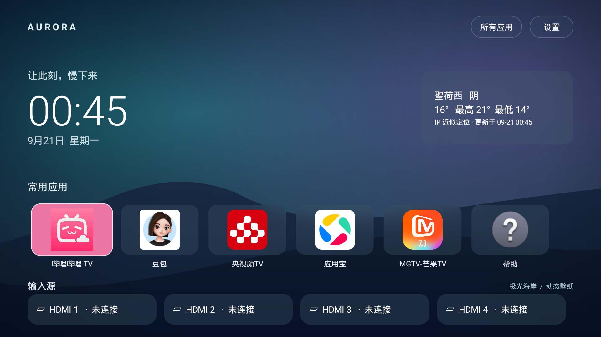

# Aurora TV

一个面向 Android TV / Sony 电视的轻量桌面，以 Apple TV 首页的简洁观感为设计参考：大尺寸应用卡片、遥控器焦点动画、玻璃面板和缓慢流动的渐变山峦。项目独立开发，与 Apple、Sony、哔哩哔哩无关联。



文档：[开发与维护记录](docs/DEVELOPMENT.md) · [真机验证记录](docs/VERIFICATION.md)

## 功能

- 首页首个应用固定为哔哩哔哩 TV 入口；已安装的电视应用自动发现。
- 保留 HDMI 输入卡片和系统输入源入口。具体输入源的直达能力取决于电视固件及系统公开接口。
- 显示所选城市的当前天气、当日高低温及更新时间；网络异常时显示缓存状态。
- 默认根据公网 IP 自动定位天气，位置缓存约 30 分钟；可立即刷新或手动选择城市。IP 反映网络出口，代理或 VPN 可能使城市与电视实际位置不同，不申请 GPS 定位权限。
- 三款原创渐变壁纸，以及本地相册多选照片轮播（最多 30 张）；淡入淡出、缓慢推拉、横向滑移三种效果，15 / 30 / 60 秒间隔，最高 25fps，离开桌面暂停。
- Android 12 / API 31 及以上使用 RenderEffect 模糊壁纸形成玻璃效果；更低版本使用半透明面板降级。

方向键移动焦点，确认键打开应用或输入源，菜单键打开设置。通过「壁纸与照片轮播」和「天气与定位」配置新功能，详见[照片与天气使用说明](docs/PHOTOS_AND_WEATHER.md)。

## 构建

需要 JDK 17、Android SDK 35 和 Android SDK Platform Tools。项目使用 AGP 8.8.0、Gradle 8.10.2，最低 Android 8.0 / API 26，`targetSdk 35`、`compileSdk 35`。

设置 `ANDROID_HOME`，或在本地 `local.properties` 中配置 `sdk.dir`，然后执行：

```sh
./gradlew assembleDebug lintDebug
```

APK 输出到 `app/build/outputs/apk/debug/app-debug.apk`。Lint 报告输出到 `app/build/reports/`。GitHub Actions 配置会运行相同的构建和 Lint，并上传调试 APK 与报告；远端运行结果以实际工作流为准。

## 部署与恢复桌面

先在电视开启开发者选项及 ADB 调试，用 `adb devices` 确认设备并完成电视端授权。下文的 `SERIAL` 替换为实际设备序列号或网络 ADB 地址；公共仓库不保存私人设备地址。

在更换默认桌面之前，记录原桌面的组件名：

```sh
adb -s SERIAL shell cmd package resolve-activity --brief \
  -a android.intent.action.MAIN -c android.intent.category.HOME
```

部署并启动桌面：

```sh
./scripts/deploy.sh SERIAL
```

确认遥控器、应用和输入源入口符合预期后，设置为默认 HOME：

```sh
./scripts/set-home.sh SERIAL
```

需要恢复时，将 `ORIGINAL_COMPONENT` 替换为先前记录的组件名，例如 `com.example.launcher/.HomeActivity`：

```sh
./scripts/restore-home.sh SERIAL ORIGINAL_COMPONENT
```

输入源切换、系统 HOME 行为和开机启动表现可能随电视固件不同。已在 Sony BRAVIA 4K VH21 / Android 12 验证系统重启自动进入桌面、Home 返回及四个 HDMI 输入会话，详情见[真机验证记录](docs/VERIFICATION.md)。待机唤醒及各 HDMI 外设仍应在目标设备上分别验证。

## 源码结构

应用包含七个 Java 源文件，使用原生 Android UI、网络及绘图 API，无第三方运行时依赖：

| 文件 | 职责 |
| --- | --- |
| `LiquidGlassFrame.java` | 可切换液态玻璃、壁纸折射、高光和焦点动画 |
| `MainActivity.java` | 首页、遥控器焦点、玻璃面板、设置与生命周期 |
| `LauncherRepository.java` | 应用发现、哔哩哔哩优先、HDMI 与系统入口 |
| `WeatherService.java` | IP 定位、城市搜索、天气请求、本机缓存与错误处理 |
| `WallpaperView.java` | 原创动态背景、照片轮播、过渡效果与动画调度 |
| `PhotoPickerActivity.java` | 遥控器相册多选与图片访问权限 |
| `PhotoStore.java` | 图片方向修正、缩放、私有副本与导入失败回滚 |

壁纸是项目自身的程序化绘图实现，随代码采用 MIT 许可；当前没有集成第三方壁纸引擎，也不需要下载壁纸素材。

## 数据、隐私与许可

天气由 [Open-Meteo](https://open-meteo.com/) 提供，天气数据采用 [CC BY 4.0](https://creativecommons.org/licenses/by/4.0/)；城市搜索数据来自 [GeoNames](https://www.geonames.org/)。界面与本文保留数据来源署名。

当前使用 Open-Meteo 的免费非商业 API，无需 API Key。数据许可与托管 API 的使用条款是两回事：商业部署应按照 [Open-Meteo 服务条款](https://open-meteo.com/en/terms) 和 [商业方案](https://open-meteo.com/en/pricing) 配置合适的服务端点。

自动定位通过 [IPwho.is](https://ipwhois.io/documentation) 的 HTTPS 接口进行，该服务会收到连接的公网 IP；Open-Meteo 接收近似城市坐标及连接的公网 IP。仅在手动搜索时向 Open-Meteo 发送城市关键词。IP 地址不写入应用日志。服务不可用时显示失败提示或带更新时间的上次缓存。

照片访问仅在打开选图功能时请求相应权限。选中图片在后台缩小至最大 1920×1080 的私有副本，不上传、不修改原图；清空照片只删除副本。城市设置、天气缓存及壁纸选择存于本机。不包含广告、账户系统或分析 SDK。电视上已安装应用的名称和图标属于各自权利人，运行时从设备读取。

项目代码和原创壁纸采用 [MIT License](LICENSE)。仓库提供 GitHub 开源所需的基础文件；不代表已经创建远端仓库或发布版本。

### 液态玻璃（v0.3.0）

设置 → 液态玻璃 → 启用液态玻璃。默认开启，即时切换并保存；关闭恢复毛玻璃。天气、应用及 HDMI 卡片支持边缘折射、高光和焦点扫光，文字图标保持清晰。参见 [效果与兼容性说明](docs/LIQUID_GLASS.md)。
