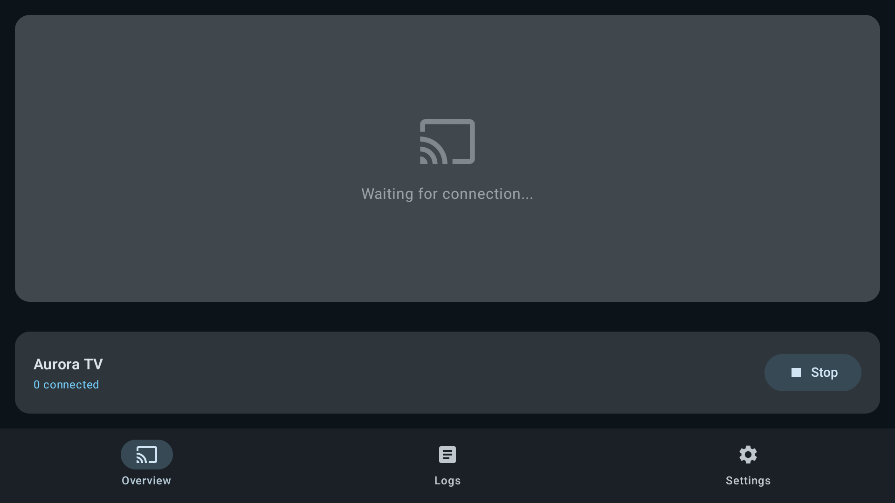

# AirPlay 接收服务

Aurora TV 0.4.0 增加首页 AirPlay 按钮及“设置 → AirPlay 接收”入口。通过 Android Intent 打开独立开源接收器；安装状态只表示已安装，不是运行状态。启动/停止、名称、PIN、开机自启均在接收器管理。

## 使用

1. 打开首页 AirPlay → 打开接收端，Overview 页面显示等待连接；Stop 可停止，Start 可启动。
2. Settings → Server name 设置为 `Aurora TV`，编辑后移开输入框焦点以保存。Start server at boot 和 Run in background 保持开启。默认原名称为 Android AirPlay。
3. 电视和 Apple 设备连接同一局域网，在 iPhone/iPad 控制中心“屏幕镜像”或 Mac“屏幕镜像”选择 Aurora TV。
4. 返回 Launcher 后前台服务继续接收；发起连接时自动显示投屏界面。安装脚本授予接收器“显示在其他应用上层”，用于后台拉起接收界面。
5. 默认未启用 PIN，可在 Settings → Require PIN (Beta) 开启；关闭接收使用 Stop。彻底停用时同时关闭开机启动以及开发者设置中的自动启动，或卸载独立接收器。

## 安装及源码

```sh
scripts/install-airplay.sh DEVICE_SERIAL
```

脚本下载固定版本、核对 SHA-256 后安装未修改的上游签名 APK。它不会覆盖 Launcher 默认桌面，也不移除已有投屏软件。当前设备原有乐播广播仍保留；Apple 列表中可能同时出现两个电视名称。

接收器为 [android-airplay-server v0.0.31](https://github.com/jqssun/android-airplay-server/tree/v0.0.31)，基于 UxPlay，GPL-3.0-only。源码固定于 `third_party/airplay-server` Git 子模块；来源、摘要、签名及构建条件见 [第三方说明](../third_party/README.md)。本次采用已有 Android 移植并完成 Sony 安装和 Launcher 集成，未自行重写或编译其协议栈。

Launcher 仍独立使用 MIT；接收器及其依赖按各自许可证分发。准备在 GitHub 发布时保留子模块、来源和许可证。独立接收器不计入 Launcher 的七个 Java 文件及零第三方运行时依赖。

## 支持边界

上游支持屏幕镜像、AAC 音频及普通视频/HLS播放，使用 Android MediaCodec 硬件解码；ALAC 默认关闭。这里的 AirPlay 2 兼容使用 UxPlay legacy 协议，不等于 Apple 认证的完整 AirPlay 2：不支持多房间同步音频，也不支持 Apple TV 等 DRM 视频。参见 [上游说明](https://github.com/FDH2/UxPlay)。

后台服务返回 START_NOT_STICKY；系统强制终止进程后可能需要重新打开接收端。网络切换、电视深度待机恢复和所有 iOS/macOS 版本组合未保证，若列表不出现，先打开接收端重新启动服务，再检查路由器是否隔离无线客户端或阻断组播。无需公网端口映射。

## 检查

macOS Bonjour：

```sh
dns-sd -B _airplay._tcp local.
dns-sd -B _raop._tcp local.
dns-sd -L 'Aurora TV' _airplay._tcp local.
python3 scripts/check-airplay.py TV_IP
```

`dns-sd` 持续运行，查看结果后 Ctrl-C。RTSP 探测可能触发接收端前台显示，这是上游连接处理行为。协议响应及设备发现不代表真实投屏音画已经验证，需另行在 Apple 设备发起会话。

## 实机状态

Sony Android12 已安装，接收名称 Aurora TV；Mac Bonjour发现、RTSP入口及整机重启自启动已验证。当前保持后台接收。开机桌面出现后需等待系统BOOT_COMPLETED广播，服务可能稍晚启动。真实音画会话尚未验证。


