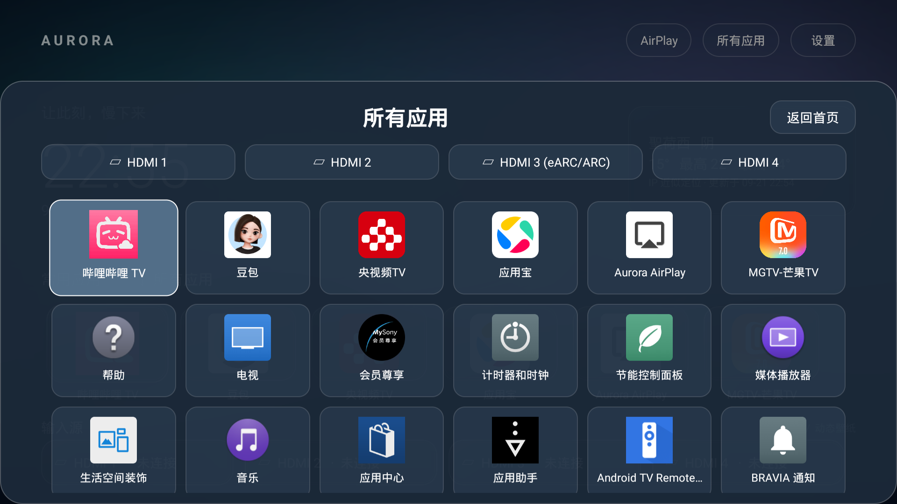

# Aurora AirPlay 常驻接收（0.5.0）

Launcher 和接收器分别安装。首页启动或回到前台时，Launcher 直接调用接收服务，不需要打开 AirPlay 界面或手动点击 Start。广播名称默认为 **Aurora TV**；iPhone、iPad、Mac 在同一局域网通过“屏幕镜像”选择它。

## 操作

首页 AirPlay / 设置 → AirPlay 接收用于调整名称、配对 PIN 等。接收服务保持后台前台通知，离开接收界面、返回桌面或打开其他应用后仍运行。Require PIN 默认为关闭。接收器 Stop 可以停止当前会话和服务；下次回到 Launcher 会再次启动，这是本版的自动接收设计。

首页任何位置按一次下键拉出全部应用抽屉；顶部 HDMI 快捷入口、6 列应用图标支持遥控器导航。返回键收起并恢复原焦点。抽屉打开时下键只移动应用焦点，不会重复打开。

## 常驻实现

- Launcher `onResume` 调用 `startForegroundService`，启动的是 `dev.aurora.airplay/io.github.jqssun.airplay.service.AirPlayService`，不拉起 Activity。
- 服务导出入口受签名级权限 `dev.aurora.tv.permission.CONTROL_AIRPLAY` 保护；两个APK必须用同一签名。其他普通应用不能随意控制服务。
- 服务立即提升为前台服务，返回 `START_STICKY`，处理系统传入的空 Intent 重建；初始化失败30秒后重试。任务划走不停止，显式 Stop 取消重试并 stopSelf。
- 原生库、组播锁、唤醒锁在销毁时释放；纯 TCP 探测不再抢占桌面。仅实际视频会话或 PIN 配对打开接收界面。
- 保留开机广播启动；电视桌面进入前台也主动确保服务运行。

“常驻”依赖 Android 的前台服务及重建机制，并非系统不可杀进程。强行停止/禁用应用会阻止系统自动重启；回到 Launcher 可显式启动接收器。深度待机、断网恢复及长期运行仍受电视系统策略影响。

## 构建和安装

```sh
# JDK17+，SDK36（Launcher 使用SDK35），两个应用用同一本机debug签名
scripts/install-airplay.sh DEVICE_SERIAL
```

安装脚本会构建接收器和 Launcher、先安装接收器再装桌面，允许接收器后台显示投屏界面，停止旧版上游接收器，最后启动桌面。它不卸载第三方桌面/乐播，设备清理另见验证记录。

基于 [android-airplay-server v0.0.31](https://github.com/jqssun/android-airplay-server/tree/v0.0.31) 的源改造保存在 `patches/airplay-resident.patch`，独立包名 `dev.aurora.airplay`，版本 `0.0.31-aurora.1`。上游 Git 子模块固定原始提交、不写入未发布的子模块提交，便于完整开源。补丁沿用 GPL-3.0-only；Launcher 保持 MIT。

本次构建修改后的 Kotlin/Java 和资源，复用校验过 SHA-256 的官方0.0.31 APK四个原生库，仅打包Sony所需armeabi-v7a；没有声称重新编译协议栈。也支持按上游条件从源码构建原生库。详见 [补丁及构建说明](../patches/README.md) 和 [第三方来源](../third_party/README.md)。

## 支持边界和检查

上游支持镜像、AAC音频和普通视频，使用UxPlay legacy协议；不支持完整AirPlay2多房间同步及Apple DRM视频。[上游说明](https://github.com/FDH2/UxPlay)

```sh
dns-sd -B _airplay._tcp local.
dns-sd -B _raop._tcp local.
dns-sd -L 'Aurora TV' _airplay._tcp local.
python3 scripts/check-airplay.py TV_IP
```

Bonjour发现/RTSP响应只能验证服务入口，不替代Apple真实音画会话。实际镜像、同步和DRM兼容性测试范围见 [验证记录](VERIFICATION.md)。

## 应用抽屉实机图


