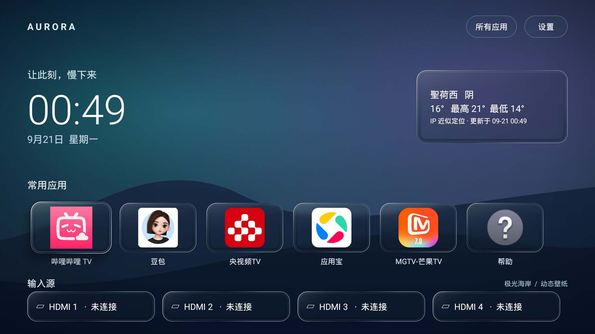
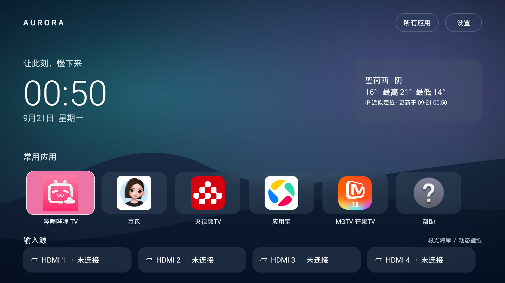

# 液态玻璃

版本：0.3.0。入口：遥控器菜单键或首页“设置” → “液态玻璃” → “启用液态玻璃”。确认键切换，返回键退出。默认开启；选择保存在本机，应用重启后保留。关闭时恢复原毛玻璃，哔哩哔哩卡片恢复粉色。

## 效果与实现

天气、应用、HDMI 卡片共用 `LiquidGlassFrame`。中心背景轻微放大，边缘采用不同倍率采样模拟折射，叠加渐变高光、内阴影及聚焦短扫光。文字和图标位于材质层上方，不参与模糊。支持现有动态壁纸及照片背景；无需新权限、联网或第三方运行时依赖。

背景只在已有壁纸刷新节奏中重新采样（常态最多每秒一次，照片过渡最多每秒十次）。材质动画只在焦点变化时运行，离开首页、隐藏或销毁时停止；路径及渐变按尺寸缓存。关闭后没有折射采样及材质扫光。

Android 12 / API 31 以上使用 RenderEffect 背景模糊（开启7dp、关闭22dp）；更旧系统保留染色、高光及采样，不具备相同实时模糊。Sony 测试设备为 Android 12，未使用需要更高系统版本的 RuntimeShader。此版本使用局部缩放近似光学折射，不是物理折射仿真，也不宣称复现某个 iOS 版本的私有实现。

设计参考：[Apple Materials](https://developer.apple.com/design/human-interface-guidelines/materials) 和 [Liquid Glass](https://developer.apple.com/documentation/TechnologyOverviews/liquid-glass)。实现参考：[Android RenderEffect](https://developer.android.com/reference/android/graphics/RenderEffect)。

## 实机对比

开启：

关闭：

较平缓的渐变背景主要呈现高光和层次；照片等有明确纹理的背景更容易观察折射。电视 GPU 性能及照片尺寸会影响流畅度，可随时关闭。
