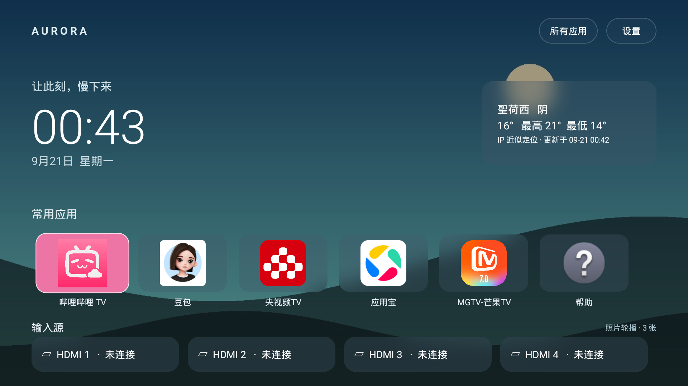

# v0.5.0 常驻接收、应用抽屉及设备清理（2026-09-21）

- Launcher assembleDebug / lintDebug成功（0 errors / 14 warnings）。Aurora AirPlay修改源码构建成功，并从固定上游+补丁通过scripts/build-airplay.sh重新生成成功；产物只含armeabi-v7a协议库，复用四个已校验上游native二进制。
- Projectivy Launcher com.spocky.projengmenu完整卸载；乐播com.hpplay.happyplay.aw移除更新并对用户0卸载，系统只读底包保留。卸载前APK和元数据备份至本地artifacts/uninstall-backup。默认HOME在卸载前后都解析为dev.aurora.tv/.MainActivity。
- 首页下键打开6列网格抽屉，首焦点为哔哩哔哩；连续下键滚动到NewTV极光，返回后焦点恢复哔哩哔哩。HDMI入口保留在抽屉上方。
- 首次安装dev.aurora.airplay后，仅启动Launcher；dumpsys显示recentCallingPackage=dev.aurora.tv，isForeground=true、stopIfKilled=false，RTSP检查通过，接收Activity从未手动打开。
- Mac Bonjour发现Aurora TV，已移除乐播广播；原上游io.github.jqssun.airplay在新服务通过检查后卸载，避免重复接收器。
- shell直接启动受保护服务返回Requires permission，Launcher同签名调用成功。
- 使用am crash模拟接收器崩溃：PID30630消失，系统安排约1秒后重建，恢复为30808，RTSP再次通过；期间Launcher始终前台。run-as kill被电视SELinux拒绝，因此未把它计作终止测试。日志中shell诱发的崩溃是预期测试事件。
- force-stop接收器后，在已前台Launcher送入新HOME Activity Intent，触发onNewIntent再次启动服务，RTSP通过。
- 纯RTSP探测后mResumedActivity仍为Launcher，不再出现旧版抢屏。
- 整机重启后未打开接收器界面，Launcher自动启动接收服务（recentCallingPackage=dev.aurora.tv），RTSP再次通过；默认HOME仍是Aurora。
- 重启后在抽屉按上键定位HDMI1、确认进入Sony电视输入Activity，Home返回Aurora；仅验证切换入口，无HDMI信号源播放。
- 实际Apple音画会话、网络切换、长时间待机恢复仍未验证；常驻采用Android前台服务+START_STICKY，不保证系统永不杀进程。

# v0.4.0 AirPlay 集成验证（2026-09-21）

- Launcher `assembleDebug lintDebug` 成功，0 errors / 13 warnings；覆盖安装0.4.0，哔哩哔哩仍为首页第一项。
- 安装未修改的上游 AirPlay Server 0.0.31，APK SHA-256、签名校验通过；Sony Android12 / armeabi-v7a 可运行。
- 接收名称已设为 Aurora TV。Mac Bonjour 实际发现 `_airplay._tcp` 和 `_raop._tcp`；解析端口7000，TXT提供设备特征。
- `scripts/check-airplay.py` 的 RTSP OPTIONS 返回200 OK及CSeq。`GET /server-info` 在此版本返回404，不用此旧端点作为健康检查。
- 返回 Launcher 后前台服务仍运行；接收器 Stop / Start 已操作验证。首页 AirPlay及设置菜单可打开说明，再进入正确的接收Activity。
- 执行整机重启：早期桌面出现时端口尚未监听，BOOT_COMPLETED 后服务自动启动，日志记录 Aurora TV 两种NSD注册；约一分钟内RTSP检查再次通过。默认桌面仍为 Aurora。
- 保留原乐播服务，两个广播名称互不混淆；未改变HDMI或默认桌面配置。
- **未验证实际Apple设备音视频流、音画同步、DRM、网络切换及长时间待机恢复。** Mac Bonjour发现与RTSP响应仅证实可发现和接收端协议入口工作。上游不支持多房间同步音频/Apple DRM视频。

# v0.3.0 液态玻璃验证（2026-09-21）

- `assembleDebug lintDebug` 成功，Lint 0 errors / 13 warnings；新增 ViewConstructor 警告来自仅代码创建、必须提供 WallpaperView 的组件，不用于 XML inflate。
- Sony BRAVIA Android 12 / API 31 安装覆盖成功，版本 0.3.0。
- 通过遥控器菜单和方向/确认键关闭、开启液态玻璃；截图确认旧毛玻璃/粉色首卡恢复及新高光边缘出现。
- 关闭后 force-stop 冷启动，偏好仍为 false，截图验证关闭样式；最终恢复 true。
- 连续方向键经过应用、天气及 HDMI，短测 224 帧：P50 14ms、P90 32ms、P95 34ms，Janky 12/224（5.36%），无漏 Vsync。此为密集按键短测，不是稳定60fps保证，也不是照片轮播长期负载测试。
- 检查 AndroidRuntime 错误日志无输出。材质动画仅焦点触发，暂停/离屏/销毁均取消。
- 本次未重复整机重启及 HDMI 信号播放测试；已有验证见下文。新增效果在照片轮播下未单独做性能基准。

# 真机验证记录

## 0.2.0：IP 天气与照片轮播

2026-09-21，同一台 Sony BRAVIA / Android 12 实测：

- `assembleDebug assembleDebugAndroidTest lintDebug` 成功，Lint 0 errors、12 warnings（包括 TV 横屏、原生 Exif、同步写入偏好及国际化等建议）。
- 升级后自动使用公网 IP 定位并加载对应天气，首页标注 IP 近似定位；当前网络出口返回的城市与原固定杭州不同。
- 原生照片权限弹窗、相册列表与遥控器连续多选通过，使用三张专门生成的测试图片，含一张竖图。
- 选择三张后导入成功；15 秒自动轮播、三种效果配置、手动下一张及横向滑移中间帧均已验证。
- 强制停止并重新启动应用后，照片集合、背景来源、间隔和效果保留。
- 清空副本后恢复渐变壁纸；原相册文件仍存在。验证结束清理了本次生成的测试相册。
- 原生 instrumentation 的 12 项照片回归检查全部通过：去重、主线程回调、图片尺寸/比例、Exif 方向像素、损坏文件回滚、失败临时文件清理、空选择、30 张上限、替换清理和原图不变。
- 照片轮播短时性能采样 2,118 帧，中位 6ms、P90 7ms、P95 22ms，系统统计 janky frames 7.70%。这包含过渡，不能与不同采样条件下的旧版数据直接比较。

本次未测试真实 USB 外设、Android 13/14 的照片授权界面、长时间稳定性或真实断网。Sony 固件的系统文件选择器为占位程序，应用检测后提示使用本地相册。0.2.0 测试为应用冷启动恢复；整机开机 HOME 的验证记录属于下方 0.1.0。

操作与测试命令见 [照片与天气使用说明](PHOTOS_AND_WEATHER.md)。下图使用测试图片演示，不包含用户相册照片。

## 0.1.0：初始版本

设备：Sony BRAVIA 4K VH21，Android 12 / API 31；系统配置为 1920×1080 输出，density 320。日期：2026-09-21。

## 已通过

- `./gradlew assembleDebug lintDebug`：成功，Lint 0 errors、5 warnings（TV 横屏、banner 尺寸、备份配置与中文字符串国际化建议）。
- ADB 安装及启动，首页首个焦点为哔哩哔哩 TV。
- 通过遥控器确认键打开 `com.xiaodianshi.tv.yst/.ui.main.MainActivity`。
- 设置默认 HOME 后，从 B站及 Sony 输入界面按 Home 返回 Aurora TV。
- 从首页遥控器导航逐一打开 HDMI 1–4；`dumpsys tv_input` 验证实际会话分别绑定 Sony HW2–HW5。
- 杭州天气在线加载、温度及当日高低温展示；本机天气缓存已写入。
- 在电视内搜索 `Hangzhou` 返回带行政区的城市选择列表。
- 菜单键打开设置；切换全部三套壁纸，重启应用后保留选择。
- 安装更新后保留天气城市和壁纸配置。
- ADB 重启整台电视后，不发送 Home 或启动命令，系统自动进入 Aurora TV；`sys.boot_completed=1`、默认 HOME 和前台 Activity 均验证成功，天气及配色保留。

## 性能采样

背景最高 25fps。玻璃面板采用实际 RenderEffect 背景模糊，缓动壁纸的模糊采样每秒更新一次，避免重复计算全部面板。优化后的真机静置采样为 404 帧，中位绘制耗时 12ms，P90 13ms，P95 14ms，系统统计 janky frames 4.70%。这是一段短时采样，不等同于稳定性或所有电视的性能保证。

## 验证边界

HDMI 端口当前均未连接信号源，因此仅验证入口、系统输入会话和无信号界面，没有验证外接设备的视频、音频或 HDMI-CEC。未断开电视网络测试离线模式，避免切断无线 ADB；离线缓存和并发请求路径经代码审查。Android 8–11 的透明降级未在真机测试。GitHub CI 尚未远端执行。

安装包、屏幕截图、性能原始输出和原桌面组件记录位于被 Git 忽略的 `artifacts/`，私人设备地址不写入公共代码或部署脚本。
